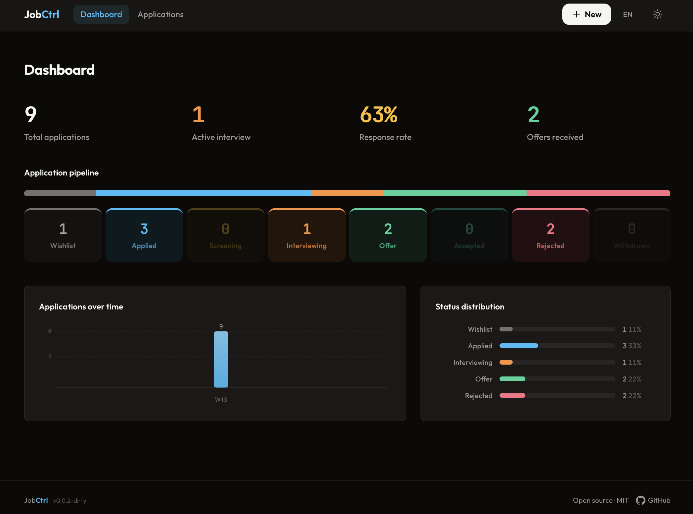

<p align="center">
  
</p>

<h1 align="center">JobCtrl</h1>

<p align="center">
  Self-hosted job application tracker. Single Go binary, SQLite database, zero cloud dependencies.
</p>

<p align="center">
  
  
  
  
</p>

<p align="center">
  
</p>

## Features

- **Full application tracking** — status pipeline, interviews, contacts, timeline
- **Auto-fill from URL** — paste a job listing URL, fields are extracted automatically (JSON-LD / Open Graph)
- **Dashboard** — stats, pipeline view, charts
- **Bilingual** — French & English
- **Dark mode** — warm stone palette, no pure black
- **Self-hosted** — your data stays on your machine, single binary, no accounts

## Quick start

### Docker (recommended)

```bash
docker compose up -d
```

Open [http://localhost:8080](http://localhost:8080). Data is persisted in a Docker volume (`job-ctrl-data`).

### From source

Requires Go 1.26+, Node.js 22+

```bash
git clone https://github.com/karl-cta/jobctrl.git
cd jobctrl
make install   # frontend deps
make build     # frontend + Go binary
./job-ctrl     # starts on :8080
```

## Configuration

| Variable | Default | Description |
|----------|---------|-------------|
| `JOB_CTRL_DB_PATH` | `job-ctrl.db` | SQLite database path |
| `JOB_CTRL_ADDR` | `:8080` | Listen address |

## Development

```bash
make dev       # Go :8080 + Vite :5173 with hot reload
go test ./...  # tests
```

## API

All routes under `/api`, JSON responses.

| Method | Route | Description |
|--------|-------|-------------|
| `GET` | `/applications` | List (filters: `status`, `search`, `sort`) |
| `POST` | `/applications` | Create |
| `GET/PUT/DELETE` | `/applications/:id` | Read / update / delete |
| `POST` | `/extract` | Auto-fill from job URL |
| `GET/POST` | `/applications/:id/interviews` | Interviews |
| `GET/POST` | `/applications/:id/contacts` | Contacts |
| `GET` | `/stats` | Dashboard stats |
| `GET` | `/export` | Full JSON export |
| `GET` | `/health` | Health check |

## Stack

Go + [chi](https://github.com/go-chi/chi) · SQLite (pure Go, no CGO) · Vanilla TypeScript + Vite + Tailwind · Docker

## License

MIT
